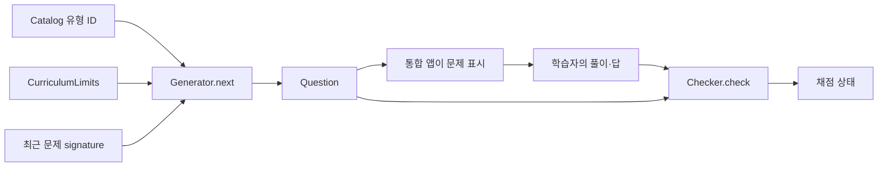

# 곰곰 수학 엔진

Android 화면과 독립적으로 문제를 생성하고, 입력한 풀이와 답을 채점하며, 학습 상태를 관리하는 Java 라이브러리입니다. 공개 패키지는 `com.gomgomapps.math.core`입니다.

## 먼저 읽을 파일

아래 링크는 `engine/src/main/java/com/gomgomapps/math/core/`의 실제 파일로 연결됩니다.

| 기능 | 진입 파일 | 하는 일 |
|---|---|---|
| 학습 유형 목록 | [Catalog.java](engine/src/main/java/com/gomgomapps/math/core/Catalog.java) | 유형 ID, 학년·학기·과목과 기초 관계를 등록 |
| 문제 생성 | [Generator.java](engine/src/main/java/com/gomgomapps/math/core/Generator.java) | 유형별 생성기로 연결하고 최근 문제·교육과정 제한·선택지를 적용 |
| 문제 데이터 | [Question.java](engine/src/main/java/com/gomgomapps/math/core/Question.java) | 문제문·식·답·선택지·도움·그림 정보를 보관 |
| 채점 | [Checker.java](engine/src/main/java/com/gomgomapps/math/core/Checker.java) | 풀이 단계와 최종 답, 요구하는 입력 형식을 검사 |
| 학습 진행 | [Learning.java](engine/src/main/java/com/gomgomapps/math/core/Learning.java) | 프로필·진행도·현재/보관 회차를 관리하고 문제 진행을 연결 |
| 국가별 배정 | [GlobalCurriculum.java](engine/src/main/java/com/gomgomapps/math/core/GlobalCurriculum.java) | 국가·교육과정 선택과 학년별 이용 범위를 결정 |
| 저장용 복사 | [LearningSnapshot.java](engine/src/main/java/com/gomgomapps/math/core/LearningSnapshot.java) | 화면이 소유한 상태와 저장 작업이 사용할 상태를 분리 |

## 기능별 파일 지도

| 역할 | 파일 |
|---|---|
| 목록·문제·생성·중복 관리 | `Catalog`, `Question`, `Generator`, `QuestionHistory` |
| 선택지 | `Choices`, `FoundationChoices` |
| 정확한 수·식·답 입력 | `Rational`, `Expression`, `MathText`, `FractionInput`, `Checker`, `WorkAnswer` |
| 대수·방정식·부등식 | `Algebra`, `FactorForm`, `LinearInequality`, `LinearSystem`, `LinearSystemHelp`, `QuadraticRelations`, `QuadraticWork`, `ComplexQuadraticWork` |
| 복소수·근호 | `Complex`, `ComplexWork`, `Radical`, `RadicalQuestions`, `RadicalWork` |
| 풀이 도움·그림 | `HelpPlan`, `StudyGuide`, `StudyDiagram`, `NumberBond` |
| 분수·함수·세로 계산 | `FractionWork`, `FractionProducts`, `MixedFractions`, `FunctionWork`, `VerticalWork`, `DecimalDivision` |
| 기초·영역별 문제 | `EarlyBasics`, `ElementaryBasics`, `SecondaryBasics`, `AdvancedBasics`, `NumberFoundations`, `NumberExtensions`, `MeasurementFoundations`, `StrandFoundations`, `StatisticsBasics` |
| 수·비율·응용 문제 | `SquareFractionFoundations`, `CubeFoundations`, `RateFoundations`, `MassDensity`, `MotionFoundations`, `MoneyFoundations`, `IndexLaws`, `PowerLogPractice`, `CombinatoricsPractice`, `MatrixDimensions` |
| 기하 문제 | `SolidFoundations`, `SurfaceGeometry`, `CompoundGeometry`, `IntegerRightTriangles` |
| 교육과정·선택 | `Curriculum`, `CurriculumLimits`, `GlobalCurriculum`, `TopicSelection` |
| 진단·복습·회차·복원 | `Learning`, `Diagnosis`, `Review`, `Deferred`, `TimedStudy`, `LearningSnapshot` |

각 이름의 파일 확장자는 `.java`입니다. 이 구분은 읽기 안내이며 독립 배포 패키지 목록이 아닙니다.

## 문제 생성과 채점의 연결



`Generator.next(skillId, recent, multipleChoice)`로 문제를 얻습니다. `recent`에는 최근 문제의 `signature()`를 넣습니다. 작은 문제 영역에서는 모든 문제가 소진되면 반복될 수 있으며, 중복이 영구적으로 사라진다는 보장은 없습니다. 제한을 적용하려면 네 번째 인수로 `CurriculumLimits`를 전달합니다.

`Checker.check(question, steps, answers)`는 `CORRECT`, `WRONG_STEP`, `WRONG_ANSWER`, `INPUT_NEEDED` 중 하나를 반환합니다. 풀이·답을 자동으로 고쳐서 맞았다고 처리하지 않습니다. 객관식이면 선택한 항목의 문자열을 답으로 전달합니다. 프로덕션 UI에서 `question.answers`를 학생에게 그대로 표시하지 않습니다.

## 실행 예시

JDK 17 이상과 Gradle 8.14.3이 필요합니다. 저장소 루트에서 실행합니다.

```sh
gradle :math:engine:classes
javac -encoding UTF-8 -cp math/engine/build/classes/java/main -d math/examples/build math/examples/GenerateAndCheck.java
java -cp "math/examples/build:math/engine/build/classes/java/main:math/engine/build/resources/main" GenerateAndCheck
```

Windows에서는 마지막 명령의 classpath 구분자 `:`를 `;`로 바꿉니다.

```powershell
java -cp "math/examples/build;math/engine/build/classes/java/main;math/engine/build/resources/main" GenerateAndCheck
```

[GenerateAndCheck.java](examples/GenerateAndCheck.java)는 `add100` 문제를 생성하고 명백한 오답 `-1`을 채점합니다. 문서 예시는 라이브러리 사용 방법을 보여주며 전체 앱의 학습 흐름을 대체하지 않습니다.

## 학습 상태와 저장

앱은 `Learning.State`를 소유하고 `Learning.beginPractice` 또는 `Learning.beginDiagnostic`으로 회차를 시작합니다. `Learning.ensureQuestion`은 진행 중인 문제를 유지하며 필요한 경우 새 문제를 생성합니다. 오류 기록과 문제 완료는 `markError`, `finishQuestion`으로 연결합니다. 실제 적용 예시는 기존 [CoreTest.java](engine/src/test/java/com/gomgomapps/math/core/CoreTest.java)에 있습니다.

`LearningSnapshot.capture(state)`는 상태 소유 스레드에서 호출해야 합니다. 내부에서 `Deferred.sync(state)`도 수행하므로 단순한 무변경 조회 함수로 취급하지 않습니다. 반환된 복사본을 저장 작업에 넘기고, 운영 상태를 백그라운드 저장 스레드와 공유하지 않습니다. 저장 위치·암호화·계정 동기화는 통합 앱의 책임입니다.

## 교육과정 자료

배정 데이터는 [global.tsv](engine/src/main/resources/curricula/global.tsv)에 있습니다. `PACK`은 교육과정 묶음과 출처, `MAP`은 학년과 유형 배정을 표현합니다. 파일의 다른 레코드 처리와 제한값은 `GlobalCurriculum`을 확인합니다. 이 배정은 일부 계산 기능을 연결한 것이며 각국 교육과정 전체의 검수 완료를 뜻하지 않습니다.

## 검증

```sh
gradle :math:engine:test
```

테스트는 생성·선택지·채점·회차 복원 등을 검사합니다. 기존 `CoreTest`, `CheckerBoundaryTest`, `LearningSnapshotTest`, `GlobalCurriculumTest`부터 읽으면 주요 계약을 이해하기 쉽습니다. 검사 결과를 실제 학생 학습 효과나 Android 화면 검증으로 확대해 해석하지 않습니다.

## 영역별 최근 학습 평가 (2026-10-08)

`LearningEvaluation`은 계산 유형별 최근 30문제의 첫 독립 정답을 기록합니다. 10문제 이상부터 부족(60% 미만), 보통(60% 이상 90% 미만), 우수(90% 이상)로 구분합니다. 틀린 뒤 수정한 문제, 도움을 받은 문제와 보류한 문제는 첫 독립 정답에 포함하지 않습니다. 보류 문제 재시도로 최초 기록을 덮어쓰거나 중복 집계하지 않습니다. 진단 배정과 복습 일정은 기존 경로를 유지합니다.

기존 저장 기록에 최근 결과가 없으면 누적 수치로 최근 순서를 추정하지 않습니다. 새 결과가 10개 쌓일 때까지 평가를 기다립니다. 새 목록은 기존 직렬화 버전과 저장 snapshot에 보존됩니다. 공개 저장소에는 학생의 기록, 앱 UI, 화면, APK를 포함하지 않습니다.

## 소수 계산 관계식 (2026-10-08)

`DecimalArithmeticRelations`는 소수 덧셈·뺄셈·곱셈·소수로 나누기·자연수로 나누기를 공개 문제문에서 읽어 빈 자릿값 관계식으로 구성합니다. 학생이 두 수, 소수 자릿수, 이동 배수, 정수 계산과 최종 소수를 직접 입력합니다. 정수 곱수는 불필요한 오른쪽 자릿수 단계를 줄이며, 나누기에서는 두 수의 같은 이동 또는 몫 되돌리기를 구분합니다. 배수는 10/100과 0칸의 1로 설명합니다. 계산값을 미리 표시하거나 본문 답으로 전송하지 않습니다. 기존 문제·답·국가별 생성 범위는 유지합니다. 상세 변경은 `docs/MATH_DECIMAL_ARITHMETIC_20261008.json`에 있습니다.

## 대분수 덧셈·뺄셈 관계식 (2026-10-08)

`MixedFractionRelations`는 두 대분수의 공개 자연수 부분·분자·분모를 읽어 가분수 변환, 최소공배수에 따른 통분 배수와 통분한 분자, 연산 및 약분을 17개의 빈 입력 단계로 구성합니다. 중간 분자나 공통 분모를 미리 표시하지 않습니다. 기존 국가별 학년 배정·문제 생성·선택지·정답은 유지하며 본문 답으로 전송하지 않습니다. 상세 변경은 `docs/MATH_MIXED_FRACTION_RELATIONS_20261008.json`에 있습니다.

### Blank column arithmetic relations (2026-10-08)

`add1000` and `sub1000` retain country digit limits and use blank place-value, carry and borrow relations. Existing saved guides refresh from the original operands; computed answers are not displayed or transferred. See [scope and source manifest](../docs/MATH_COLUMN_RELATIONS_20261008.json).

### Blank basic whole-number relations (2026-10-08)

Eight counting, make-ten, break-ten and three-number addition/subtraction units use learner-entered blank relations and original quantity pictures. Country operand ranges remain unchanged, including larger three-term problems. Computed current/future values are not supplied or transferred. See [scope and source manifest](../docs/MATH_WHOLE_NUMBER_RELATIONS_20261008.json), including finite low-number domain limits.

### Two-digit column relations (2026-10-08)

`add100` and `sub100` now use blank column relations, including carry and borrow. Existing `add1000`/`sub1000` also support naturally small country-specific operands. Number limits and main answers remain unchanged; no computed answer is prefilled or transferred. See [scope and validation](../docs/MATH_TWO_DIGIT_COLUMN_RELATIONS_20261008.json).

### Basic group relationships (2026-10-08)

`tables` and `divide` use blank group relationships for normal equations and either missing operand. Student-entered given values precede the calculation; computed values are never prefilled or transferred. Existing country-specific fact limits and choices remain unchanged. Default division has 72 ordered equations; selected Singapore curricula retain 100 distinct equation forms without claiming 100 distinct numeric facts. See [scope and validation](../docs/MATH_FACT_RELATIONS_20261008.json).

### Whole-number multiplication and division (2026-10-08)

Nine elementary units now use blank learner-entered relationships: repeated groups, multi-digit multiplication, exact division and division with a remainder. Multiplication splits both factors into single-digit facts and place values; division walks through quotient digits, subtraction and bringing down. Helpers preserve existing curriculum ranges and problem forms and never fill the main answer. See [scope and engine validation](../docs/MATH_INTEGER_RELATIONS_20261008.json).

### Rounding and estimation relationships (2026-10-08)

Five existing units now use blank learner-entered rounding steps: natural-number rounding, rounding up, rounding down, decimal rounding and addition after estimating both terms. The learner identifies the rounding place and the decision digit or discarded amount, chooses Increase or Keep, and supplies the truncation and increment. Helpers preserve existing national limits and never fill the main answer. See [scope and engine validation](../docs/MATH_ROUNDING_RELATIONS_20261008.json).

## 시간·날짜 단위 관계식 (2026-10-08)

`TimeUnitRelations`는 시간·분·초 및 주일·일 변환과 시각 덧셈·차 9개 단원에서 공개 문제의 값을 학생 입력으로 연결합니다. 1시간=60분, 1분=60초, 1주일=7일이라는 고정 단위 관계를 제시하고 계산칸은 비웁니다. 원래 문제·정답·선택지·국가별 생성 범위를 유지하며 도움 답을 본문으로 자동 전송하지 않습니다. 화면의 참고값은 이전 단계에서 학생이 입력하고 확인한 값입니다.

옛 도움 초안은 새 관계식 버전으로 갱신하고, 새 버전의 부분 입력은 복원합니다. 공개 원문의 수로 별도 계산한 oracle, 0 나머지·시각 자리 넘김·잘못된 시각, 모든 단원 각600개 생성·100개 이상 서로 다른 문제와 기존 정답 채점을 검사했습니다. 이는 엔진 검사이며 실물 기기·학생 이해·모든 교육과정 지원이나 출시 완료를 뜻하지 않습니다. [검사 범위](../docs/MATH_TIME_UNIT_RELATIONS_20261008.json)

### Length, capacity and mass relationships (2026-10-08)

Twelve units use blank learner-entered quantities and unit relationships. Fixed definitions such as 1 L = 1000 mL teach the unit; the learner supplies the calculation. Mixed quantities convert the larger part before combining it with the smaller part. Main answers are never filled by help. Six conversion units now include adding or subtracting two quantities before conversion, within the existing operand bounds. Each unit has at least 100 distinct public prompts in 1200 generated samples, without claiming 100 distinct answers or numeric facts. Direct question creation, normal generation and restored help use the same relationship guide. See [scope and validation](../docs/MATH_MEASURE_UNIT_RELATIONS_20261008.json).

### Area and volume unit relationships (2026-10-08)

Square and cubic unit conversion now use the same learner-entered relationship guide as the other measurement units. Area, volume and linear units remain separate: 1 m² = 10000 cm² and 1 m³ = 1000000 cm³. The learner supplies quantities, the unit relation and the result; the app never fills the main answer. Pure conversion is retained alongside addition/subtraction before conversion within the original 20 m² / 8 m³ bounds. All fourteen measurement units generate at least 100 distinct public prompts in 1200 samples each, without claiming 100 distinct answers or facts. Direct question creation, independent unit calculations, dimension mismatch rejection and partial-draft restoration are checked. See [scope and validation](../docs/MATH_UNIT_DIMENSIONS_20261008.json).

### Reading clock hands (2026-10-08)

Hour, minute and second readings now use learner-entered blanks and never transfer a completed helper answer into the main answer. Fine minute/second readings separate large and small marks before addition; only earlier checked learner values appear as references. The original clock drawings and country-specific minute resolution remain unchanged. Each unit has at least 100 distinct clock drawings in 1200 generated samples, without claiming 100 different answers or an authored bank. Public diagram reading, boundary validation, hidden-answer independence and draft restoration are tested. See [scope and validation](../docs/MATH_CLOCK_READING_20261008.json).

### Number patterns, pairing and missing values (2026-10-08)

Six elementary units now use learner-entered named relationships instead of question-specific numerical equations. Increasing/decreasing sequences use positive gaps, repeating pairs vary the blank position, and parity keeps pure-number questions alongside bounded addition/subtraction before pairing. Known/whole/remaining parts support missing addition and subtraction. Only checked earlier learner values appear as references; completed help never fills the main answer. Each default unit has at least 100 distinct public prompts in 1200 samples, without claiming 100 distinct answers or numeric facts; smaller country domains keep their original finite bounds. Independent public-input calculation, hidden-key independence and draft restoration are tested. See [scope and validation](../docs/MATH_NUMBER_PATTERNS_20261008.json).

### Natural-number range boundaries (2026-10-08)

Four range units now use blank boundary calculations, an inclusion choice and a blank endpoint. At least/at most include the boundary, while greater/less than exclude it; adjacent natural numbers differ by the fixed concept 1. Boundaries remain 2..30 and public operands 1..30, with pure questions retained alongside addition/subtraction boundaries. Each unit has at least 100 distinct public prompts in 1600 samples; these still represent 29 boundary values, not 100 distinct numeric facts or an authored bank. Help never fills the main answer. See [scope and validation](../docs/MATH_RANGE_BOUNDARIES_20261008.json).

### Ratios and input-output rules (2026-10-08)

Four elementary units now use learner-entered ratio terms, numerator/reference-denominator quantities and named input-output relationships. Multiplicative input values can be given directly or as bounded sums/differences; input 1..12 and factor 2..9 remain unchanged. Each unit has at least 100 distinct public prompts in 1600 samples, without claiming new numeric facts or an authored bank. The fraction helper keeps numerator/denominator separate and permits equivalent unreduced representations. Only earlier checked learner entries appear as references; help never fills the main answer. See [scope and validation](../docs/MATH_RATIO_CORRESPONDENCE_20261008.json).

### Trapezoid and rhombus perimeters (2026-10-08)

Two perimeter units now use learner-entered side lengths, pair sums or the fixed count of four equal rhombus sides. Side lengths remain 2..20 and trapezoids retain the original scale 1..4 right-triangle construction. Pure lengths remain alongside bounded addition/subtraction side expressions. Each unit has at least 100 distinct public prompts in 1600 samples, without claiming more than 19 rhombus side values or 76 trapezoid side combinations. Only earlier checked student entries appear as references, and help never fills the main answer. See [scope and validation](../docs/MATH_PERIMETER_BOUNDARIES_20261008.json).

### Decimal places and graph reading (2026-10-08)

Four units now use learner-entered decimal positions/digits or graph counts, units, categories and percentages. Original problem domains and diagrams remain unchanged. Help does not prefill or transfer answers. Each unit has at least 100 distinct public question-plus-diagram combinations in 1600 samples; this does not imply 100 distinct answer facts or an authored question bank. See [scope and validation](../docs/MATH_READING_FOUNDATIONS_20261008.json).

### Shape and cuboid structure (2026-10-08)

Three units now teach learner-entered side counts, triangle classification and cuboid face/edge/vertex counts. Cuboids have countable wireframe and unfolded teaching diagrams while retaining the scalar and three-answer schemas. Rotations, positive horizontal stretch and cuboid proportions provide practice without claiming different fixed mathematical facts or a 100-question authored bank. Plane outline coordinate sets are deduplicated after symmetry, rather than counting raw drawing parameters. Help never prefills or transfers the main answer. See [scope and validation](../docs/MATH_SHAPE_STRUCTURES_20261008.json).


### Factor and multiple searches

Four elementary factor/multiple searches use named empty relations and checked student input references. The original search order and number domains remain intact; quotients, products and least common multiples are not prefilled. See `docs/MATH_FACTOR_SEARCH_20261008.json` for verification and boundaries.

### Whole-number comparison (2026-10-08)

`el_compare_10000` now uses blank named number and place-digit inputs, followed by a comparison-sign choice. It requires no subtraction or negative arithmetic, preserves generator bounds/signatures, and displays only checked student entries as references. [Scope and validation](../docs/MATH_WHOLE_COMPARE_20261008.json).

## Current source update

See [2026-10-08 module connections, curriculum limits and reproduction](UPDATES_20261008.md).

[Signed-integer modulo foundations and reproduction](MODULO_FOUNDATIONS.md)

[Namibia primary selected calculations](NAMIBIA_PRIMARY.md)

[Android-compatible curriculum resource reading](ANDROID_RESOURCE_READING.md)

Object grouping/sharing: [families, finite supply and scope](OBJECT_GROUPS.md).

Object grouping/sharing: [families, finite supply and scope](OBJECT_GROUPS.md).

Object grouping/sharing: [families, finite supply and scope](OBJECT_GROUPS.md).

Doubling/halving: [selected inputs and finite supply](DOUBLE_HALF.md).

Counting steps: [ranges, directions and finite supply](COUNTING_STEPS.md).

Visible collections: [learner grouping and preserved identity](COLLECTION_GROUPING.md).

Primary ordering: [selected comparison, sorting and ordinal foundations](PRIMARY_ORDERING.md).

Subitising: [selected Namibia recognition and independent recount](SUBITISING_NA.md).

Estimation: [retain the learner estimate, then group and count](GROUPED_ESTIMATION.md).

Ordering: [selected Grade2/3 range extension](ORDERING_RANGES.md).

Double and half: [selected Grade3 range and blank part strategy](DOUBLE_HALF_GRADE3.md).

Number parts: [selected multiple constructions](NUMBER_DECOMPOSITION.md).

Half/quarter pictures: [selected picture-only foundations](FRACTION_PIECES.md).

Selected Singapore Primary1 sharing/ordinal scope: [SINGAPORE_PRIMARY1.md](SINGAPORE_PRIMARY1.md).

Selected Singapore Primary6 algebra: [SINGAPORE_ALGEBRA.md](SINGAPORE_ALGEBRA.md).

Selected Singapore Primary 2 fraction supply: [SINGAPORE_LIKE_FRACTIONS.md](SINGAPORE_LIKE_FRACTIONS.md).

Fraction error location: [FRACTION_ERROR_PART.md](FRACTION_ERROR_PART.md).

Selected England Year2–4 facts: [ENGLAND_TABLE_FACTS.md](ENGLAND_TABLE_FACTS.md).

Selected England Year1–2 next-number practice: [ENGLAND_COUNTING.md](ENGLAND_COUNTING.md).

Selected England Year1 bonds/sums: [ENGLAND_BONDS_SUMS.md](ENGLAND_BONDS_SUMS.md).

Selected England quantities/comparison: [ENGLAND_NUMBERS_HUNDRED.md](ENGLAND_NUMBERS_HUNDRED.md).

Selected England numeral/word correspondence: [ENGLISH_NUMBER_WORDS.md](ENGLISH_NUMBER_WORDS.md).

Selected England objects/shape fractions: [ENGLAND_OBJECT_FRACTIONS.md](ENGLAND_OBJECT_FRACTIONS.md).

Selected Year1 numerical quantities: [ENGLAND_QUANTITY_FRACTIONS.md](ENGLAND_QUANTITY_FRACTIONS.md).

Selected object/length quantities: [QUANTITY_FRACTION_PICTURES.md](QUANTITY_FRACTION_PICTURES.md).

Selected names/equivalence: [FRACTION_NAMES_RELATIONS.md](FRACTION_NAMES_RELATIONS.md).

Selected upper numbers: [ENGLAND_UPPER_NUMBERS.md](ENGLAND_UPPER_NUMBERS.md).

Selected digit/value learning: [WHOLE_PLACE_VALUES.md](WHOLE_PLACE_VALUES.md).

Selected upper-primary sums: [ENGLAND_UPPER_SUMS.md](ENGLAND_UPPER_SUMS.md).

Selected England Year3 fractions: [ENGLAND_LIKE_FRACTIONS.md](ENGLAND_LIKE_FRACTIONS.md).

Selected England Year5 fraction sums: [ENGLAND_UPPER_FRACTION_SUMS.md](ENGLAND_UPPER_FRACTION_SUMS.md).

Selected England fraction relations: [ENGLAND_FRACTION_RELATIONS.md](ENGLAND_FRACTION_RELATIONS.md).

Selected three-fraction ordering: [FRACTION_ORDERING.md](FRACTION_ORDERING.md).

Selected equal-whole families: [FRACTION_FAMILIES.md](FRACTION_FAMILIES.md).

Selected decimal conversions: [ENGLAND_DECIMAL_LINKS.md](ENGLAND_DECIMAL_LINKS.md).

Selected tenths/hundredths counting: [scope and remaining work](ENGLAND_DECIMAL_COUNTING.md).

Tenths/hundredths unit-part help: [scope](TENTH_UNIT_RELATIONS.md).

Division by10/100 unit relationships: [scope](POWER_TEN_DIVISION.md).

Selected decimal digit and value practice: [scope and limits](DECIMAL_DIGIT_VALUE.md).

Selected same-precision comparison and nearest-whole rounding: [scope](DECIMAL_ROUNDING_COMPARISON.md).

Selected Year5 decimal relations and indexed supply: [scope](YEAR5_DECIMAL_RELATIONS.md).

Selected Year5 fraction/decimal notation through thousandths: [scope and remaining work](YEAR5_FRACTION_DECIMALS.md).

Equal amounts expressed as counts of decimal units: [scope](DECIMAL_UNIT_COUNT.md).

Full English decimal numerals and words: [scope](ENGLISH_DECIMAL_WORDS.md).

Selected decimal measurement stories: [scope and limits](DECIMAL_MEASURE_STORIES.md).

Selected percentage notation: [scope and limits](PERCENTAGE_NOTATION.md).

Selected fraction/decimal/percentage equivalence: [scope and limits](FRACTION_PERCENT_EQUIVALENCE.md).

Selected equivalent quantity stories and reverse percent notation: [scope and limits](EQUIVALENT_QUANTITY_STORIES.md).

Selected upper-primary fraction arithmetic: [scope and limits](UPPER_FRACTION_PRODUCTS.md).

Selected fraction/division/decimal relationship: [scope and limits](FRACTION_DIVISION_DECIMAL.md).

Selected decimal powers of ten: [scope and limits](DECIMAL_POWERS_TEN.md).

Selected decimal times whole-number products: [scope and limits](DECIMAL_WHOLE_PRODUCTS.md).

Selected decimal written division: [scope and limits](DECIMAL_WRITTEN_DIVISION.md).

Selected Year6 rounding: [scope and limits](YEAR6_DECIMAL_ROUNDING.md).

Contextual part-whole equivalents: [scope and limits](QUANTITY_RATIO_EQUIVALENCE.md).

Rounded equal-share contexts: [scope and limits](ROUNDED_SHARING_STORY.md).

Selected Year6 ratios: [scope and limits](YEAR6_RATIO_SPLIT.md).

Selected percentage amounts: [scope and limits](PERCENT_AMOUNT_COMPARISON.md).

Selected similar shape scales: [scope and limits](YEAR6_SHAPE_SCALE.md).

Fractional similar shape scales: [scope and limits](FRACTION_SHAPE_SCALE.md).

Selected ratio/percentage/share contexts: [scope and limits](RATIO_CONTEXT_STORIES.md).

Elementary substitution blank help: [scope and limits](PRIMARY_ALGEBRA_BLANK_HELP.md).

Selected elementary variable pairs: [scope and limits](PRIMARY_VARIABLE_PAIRS.md).

Complete elementary pair enumeration: [scope and limits](PRIMARY_PAIR_ENUMERATION.md).

Learner-generated linear sequences: [scope and limits](PRIMARY_LINEAR_SEQUENCES.md).

Composed verbal sequence rules: [scope and limits](LINEAR_SEQUENCE_DESCRIPTION.md).

Direct elementary expression writing: [scope and limits](PRIMARY_EXPRESSION_WRITING.md).

Elementary total formula: [scope and limits](PRIMARY_FORMULA_CONTEXT.md).

England Year2 place practice: [scope and limits](ENGLAND_YEAR_TWO_PLACE.md).

England Year3 written sums: [scope and limits](ENGLAND_YEAR_THREE_SUMS.md).

Selected missing-number relations: [scope and limits](MISSING_NUMBER_RELATIONS.md).

England upper-primary counting: [scope](ENGLAND_UPPER_COUNTING.md).

England Year2 arithmetic domains: [scope](ENGLAND_YEAR_TWO_SUMS.md).

Inverse answer checking: [scope](INVERSE_CALCULATION_CHECK.md).

Selected [related calculation facts](RELATED_CALCULATION_FACTS.md) derive a new blank calculation from a known fact.

Selected [mental place calculations](MENTAL_PLACE_CALCULATIONS.md) teach grouping and boundary steps separately from column arithmetic.

- [Two-digit and three-number mental strategies](MENTAL_SUM_STRATEGIES.md): selected Year2 numeric split/group teaching; broader representations/fluency remain.

- [Number-line foundations](NUMBER_LINE_FOUNDATIONS.md): selected Year1/2 visible line reading and reused verbal comparisons; wider representation/estimation remains.

- [Primary arithmetic statement signs](STATEMENT_SIGNS.md): selected Year1 missing signs, including equality in both directions.

- [Primary calculation order](CALCULATION_ORDER.md): selected addition swap and subtraction comparison without negative-number input.

- [Pictured arithmetic contexts](PICTURE_ARITHMETIC.md): mixed add/take-away stories and optional learner-authored relationships.

- [Multiplication and division order](PRODUCT_ORDER.md): numeric products and division comparison with equal and undefined exceptions.

- [Button and plate contexts](BUTTON_PLATE_STORIES.md): total, equal sharing and grouping with student-authored relationship help.

- [English number words through 1,000](UPPER_ENGLISH_NUMBER_WORDS.md): selected Year3 range, existing lower-grade bounds and student place-value blanks.

- [Year3 number lines through1,000](UPPER_NUMBER_LINES.md): public ticks at1/10/100 scales, fresh scale variety and learner-authored help.

- [Year3 collection estimation through100](UPPER_GROUPED_ESTIMATION.md): ungraded student estimates followed by independently checked public counts.

- [Year3 packs and loose objects](PRACTICAL_PLACE_STORIES.md): base-ten inventories with student numeric steps and public-given checking.

- [Year3 missing operands through1000](UPPER_MISSING_NUMBERS.md): streamed finite supply and student inverse steps.

- [Year3 quantity-change stories](QUANTITY_CHANGE_STORIES.md): initial/change/final unknowns and learner-authored inverse steps.

- [Year3 carry-based column multiplication](COLUMN_PRODUCT.md): student carry/ones/tens frames with public-given checking.

- [Public multiplication/division fact checking](PUBLIC_FACT_CHECKING.md): unique public-equation solutions, zero/ambiguity safeguards and preserved blank student help.

- [Student number-word error locations](NUMBER_WORD_FEEDBACK.md): preserve correct words, locate only incorrect tokens/gaps, distinguish input issues from valid different numbers.

- [Mental doubling and halving](DOUBLING_CALCULATION.md): two270-condition units with student-entered intermediate calculations and public-operand checking.

- [Product context stories](PRODUCT_CONTEXT_STORIES.md): equal groups, integer scaling and all-pairs correspondence with student-entered inverse relationships.

- [Year3 fractions of sets](YEAR3_SET_FRACTIONS.md):268 discrete collection conditions and public-quantity checking.

- [Fraction number lines](FRACTION_NUMBER_LINE.md):165 zero-to-one diagrams with two student-written fractions.

- [Equivalent fraction pictures](EQUIVALENT_FRACTION_PICTURES.md): two equal-sized shaded wholes and student-entered missing numerator or denominator.

- [Fractional length stories](FRACTION_LENGTH_STORIES.md): used and remaining cord lengths with student-entered like-fraction relationships.

- [1,000 more or less](THOUSAND_CHANGE.md): arbitrary starts and student-entered change relationships.

- [Counting backwards through zero](NEGATIVE_COUNTING.md): three student entries, including negative integers.

- [Year4 number lines](YEAR4_NUMBER_LINES.md): four scales through10000, with existing lower-grade domains preserved.

- [Upper practical place-value stories](UPPER_PRACTICAL_PLACE.md): inventory counts through10000 with lower-grade format preserved.

- [Roman numeral reading](ROMAN_READ.md):100 canonical readings through C with learner-owned group calculations.

- [Two-step quantity changes](TWO_STEP_CHANGES.md): learner operation/reason choices, intermediate and final counts.

- [Factor pairs and mental multiplication](FACTOR_PAIR_MENTAL.md): ordered pairs and convenient regrouping.

- [Written single-digit multiplication](WRITTEN_SINGLE_PRODUCTS.md): Year4 two/three-digit operands and existing formal layout.

- [Multiply-and-add contexts](MULTIPLY_ADD_CONTEXTS.md): distribution, extra pencils and complete group connections.

- [Year4 fractions of quantities](YEAR4_FRACTION_QUANTITIES.md): selected larger whole quantities and unit/non-unit fractions.

- [Year4 same-denominator fractions](YEAR4_LIKE_FRACTIONS.md): fresh-pair supply, then oldest.

- [Year4 quarters and halves as decimals](YEAR4_QUARTER_DECIMALS.md): existing conversion practice includes1/4,1/2,3/4.

- [Year4 measurement and money](YEAR4_MEASURE_MONEY.md): fractional length, decimal quantities and basic GBP totals/change.

- [Year5 counting in powers of10](YEAR5_POWER_COUNTING.md): arbitrary starts with two forward/backward steps.

- [Year5 practical number stories](YEAR5_NUMBER_STORIES.md): inventory, book counts, temperatures and populations.

- [Roman numerals and recorded years](ROMAN_YEARS.md): ordinary numerals through M and separate recorded-year reading.

- [Larger mental place changes](LARGE_MENTAL_PLACE.md): four-to-six-digit operands and indexed supply.

- [Large mental decomposition](LARGE_MENTAL_DECOMPOSITION.md): two large operands and place-value subtotals.

- [Convenient-number mental arithmetic](CONVENIENT_NUMBER_MENTAL.md): round and compensate with five learner-entered steps.

- [Large-number estimation checks](LARGE_ESTIMATE_CHECK.md): rounding envelopes through one million; range is not exact equality.

- [Large two-step quantity stories](LARGE_TWO_STEP_STORIES.md): mixed changes through one million and learner operation/reason choices.

- [Complete factor and multiple lists](COMPLETE_FACTOR_PRACTICE.md): all pairs, common factors and ordered positive multiples through144.

- [Learner-owned factor list marking](LEARNER_FACTOR_LISTS.md): completeness without exposing missing values or blaming valid entries.

- [Prime vocabulary practice](PRIME_VOCABULARY.md): public-given classification and prime-factor identification.

- [Small-prime recall](PRIME_RECALL.md): learner-owned lists without answer cardinality hints.

- [Up-to-four-digit written products](LARGE_WRITTEN_PRODUCTS.md): public operand supply and learner column work.

- [Year5 mental facts](YEAR5_MENTAL_FACTS.md): reuse of established mental calculation practice.

- [Short written division](SHORT_WRITTEN_DIVISION.md): quotient and carried remainders.

- [Remainders in context](REMAINDER_CONTEXTS.md): packets, leftovers, capacity and exact lengths.

- [Year5 powers of ten](YEAR5_POWERS_TEN.md): exact whole/decimal multiplication and division by10/100/1000.

- [Primary squares and cubes](PRIMARY_POWERS.md): superscript notation, calculation and recognising power numbers.

- [Factors and powers in stories](FACTOR_POWER_STORIES.md): exact packing, least production totals, repeated square boards and cube packing.

- [Combined operations and equality](COMBINED_EQUALITY.md): two-step pencil contexts and equal-valued arithmetic sides.

- [Primary scaling and rates](PRIMARY_SCALE_RATES.md): fractional batch sizes and constant-flow quantities or times.

- [Public fraction comparison and ordering](PUBLIC_FRACTION_COMPARISON_ORDER.md): final checks use visible operands and ordering direction.
