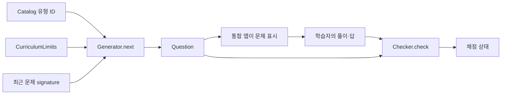

# 곰곰 수학 엔진

Android 화면과 독립적으로 문제를 생성하고, 입력한 풀이와 답을 채점하며, 학습 상태를 관리하는 Java 라이브러리입니다. 공개 패키지는 `com.gomgomapps.math.core`입니다.

## 먼저 읽을 파일

아래 링크는 `engine/src/main/java/com/gomgomapps/math/core/`의 실제 파일로 연결됩니다.

| 기능 | 진입 파일 | 하는 일 |
|---|---|---|
| 학습 유형 목록 | [Catalog.java](engine/src/main/java/com/gomgomapps/math/core/Catalog.java) | 유형 ID, 학년·학기·과목과 기초 관계를 등록 |
| 문제 생성 | [Generator.java](engine/src/main/java/com/gomgomapps/math/core/Generator.java) | 유형별 생성기로 연결하고 최근 문제·교육과정 제한·선택지를 적용 |
| 문제 데이터 | [Question.java](engine/src/main/java/com/gomgomapps/math/core/Question.java) | 문제문·식·답·선택지·도움·그림 정보를 보관 |
| 채점 | [Checker.java](engine/src/main/java/com/gomgomapps/math/core/Checker.java) | 풀이 단계와 최종 답, 요구하는 입력 형식을 검사 |
| 학습 진행 | [Learning.java](engine/src/main/java/com/gomgomapps/math/core/Learning.java) | 프로필·진행도·현재/보관 회차를 관리하고 문제 진행을 연결 |
| 국가별 배정 | [GlobalCurriculum.java](engine/src/main/java/com/gomgomapps/math/core/GlobalCurriculum.java) | 국가·교육과정 선택과 학년별 이용 범위를 결정 |
| 저장용 복사 | [LearningSnapshot.java](engine/src/main/java/com/gomgomapps/math/core/LearningSnapshot.java) | 화면이 소유한 상태와 저장 작업이 사용할 상태를 분리 |

## 기능별 파일 지도

| 역할 | 파일 |
|---|---|
| 목록·문제·생성·중복 관리 | `Catalog`, `Question`, `Generator`, `QuestionHistory` |
| 선택지 | `Choices`, `FoundationChoices` |
| 정확한 수·식·답 입력 | `Rational`, `Expression`, `MathText`, `FractionInput`, `Checker`, `WorkAnswer` |
| 대수·방정식·부등식 | `Algebra`, `FactorForm`, `LinearInequality`, `LinearSystem`, `LinearSystemHelp`, `QuadraticRelations`, `QuadraticWork`, `ComplexQuadraticWork` |
| 복소수·근호 | `Complex`, `ComplexWork`, `Radical`, `RadicalQuestions`, `RadicalWork` |
| 풀이 도움·그림 | `HelpPlan`, `StudyGuide`, `StudyDiagram`, `NumberBond` |
| 분수·함수·세로 계산 | `FractionWork`, `FractionProducts`, `MixedFractions`, `FunctionWork`, `VerticalWork`, `DecimalDivision` |
| 기초·영역별 문제 | `EarlyBasics`, `ElementaryBasics`, `SecondaryBasics`, `AdvancedBasics`, `NumberFoundations`, `NumberExtensions`, `MeasurementFoundations`, `StrandFoundations`, `StatisticsBasics` |
| 수·비율·응용 문제 | `SquareFractionFoundations`, `CubeFoundations`, `RateFoundations`, `MassDensity`, `MotionFoundations`, `MoneyFoundations`, `IndexLaws`, `PowerLogPractice`, `CombinatoricsPractice`, `MatrixDimensions` |
| 기하 문제 | `SolidFoundations`, `SurfaceGeometry`, `CompoundGeometry`, `IntegerRightTriangles` |
| 교육과정·선택 | `Curriculum`, `CurriculumLimits`, `GlobalCurriculum`, `TopicSelection` |
| 진단·복습·회차·복원 | `Learning`, `Diagnosis`, `Review`, `Deferred`, `TimedStudy`, `LearningSnapshot` |

각 이름의 파일 확장자는 `.java`입니다. 이 구분은 읽기 안내이며 독립 배포 패키지 목록이 아닙니다.

## 문제 생성과 채점의 연결



`Generator.next(skillId, recent, multipleChoice)`로 문제를 얻습니다. `recent`에는 최근 문제의 `signature()`를 넣습니다. 작은 문제 영역에서는 모든 문제가 소진되면 반복될 수 있으며, 중복이 영구적으로 사라진다는 보장은 없습니다. 제한을 적용하려면 네 번째 인수로 `CurriculumLimits`를 전달합니다.

`Checker.check(question, steps, answers)`는 `CORRECT`, `WRONG_STEP`, `WRONG_ANSWER`, `INPUT_NEEDED` 중 하나를 반환합니다. 풀이·답을 자동으로 고쳐서 맞았다고 처리하지 않습니다. 객관식이면 선택한 항목의 문자열을 답으로 전달합니다. 프로덕션 UI에서 `question.answers`를 학생에게 그대로 표시하지 않습니다.

## 실행 예시

JDK 17 이상과 Gradle 8.14.3이 필요합니다. 저장소 루트에서 실행합니다.

```sh
gradle :math:engine:classes
javac -encoding UTF-8 -cp math/engine/build/classes/java/main -d math/examples/build math/examples/GenerateAndCheck.java
java -cp "math/examples/build:math/engine/build/classes/java/main:math/engine/build/resources/main" GenerateAndCheck
```

Windows에서는 마지막 명령의 classpath 구분자 `:`를 `;`로 바꿉니다.

```powershell
java -cp "math/examples/build;math/engine/build/classes/java/main;math/engine/build/resources/main" GenerateAndCheck
```

[GenerateAndCheck.java](examples/GenerateAndCheck.java)는 `add100` 문제를 생성하고 명백한 오답 `-1`을 채점합니다. 문서 예시는 라이브러리 사용 방법을 보여주며 전체 앱의 학습 흐름을 대체하지 않습니다.

## 학습 상태와 저장

앱은 `Learning.State`를 소유하고 `Learning.beginPractice` 또는 `Learning.beginDiagnostic`으로 회차를 시작합니다. `Learning.ensureQuestion`은 진행 중인 문제를 유지하며 필요한 경우 새 문제를 생성합니다. 오류 기록과 문제 완료는 `markError`, `finishQuestion`으로 연결합니다. 실제 적용 예시는 기존 [CoreTest.java](engine/src/test/java/com/gomgomapps/math/core/CoreTest.java)에 있습니다.

`LearningSnapshot.capture(state)`는 상태 소유 스레드에서 호출해야 합니다. 내부에서 `Deferred.sync(state)`도 수행하므로 단순한 무변경 조회 함수로 취급하지 않습니다. 반환된 복사본을 저장 작업에 넘기고, 운영 상태를 백그라운드 저장 스레드와 공유하지 않습니다. 저장 위치·암호화·계정 동기화는 통합 앱의 책임입니다.

## 교육과정 자료

배정 데이터는 [global.tsv](engine/src/main/resources/curricula/global.tsv)에 있습니다. `PACK`은 교육과정 묶음과 출처, `MAP`은 학년과 유형 배정을 표현합니다. 파일의 다른 레코드 처리와 제한값은 `GlobalCurriculum`을 확인합니다. 이 배정은 일부 계산 기능을 연결한 것이며 각국 교육과정 전체의 검수 완료를 뜻하지 않습니다.

## 검증

```sh
gradle :math:engine:test
```

테스트는 생성·선택지·채점·회차 복원 등을 검사합니다. 기존 `CoreTest`, `CheckerBoundaryTest`, `LearningSnapshotTest`, `GlobalCurriculumTest`부터 읽으면 주요 계약을 이해하기 쉽습니다. 검사 결과를 실제 학생 학습 효과나 Android 화면 검증으로 확대해 해석하지 않습니다.
